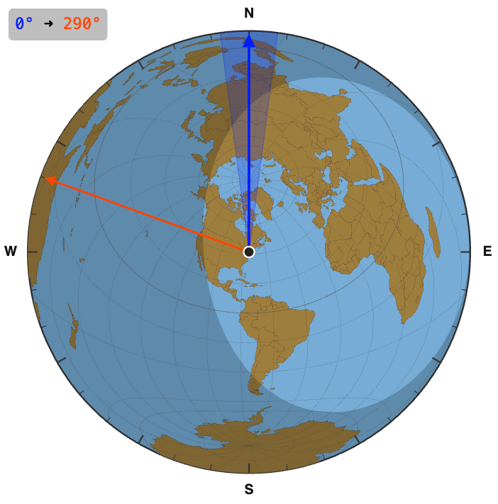

# Ham2K RED Toolkit

`@ham2k/red-ham-toolkit` — a collection of free and open-source Ham Radio tools
(nodes & widgets) for [Node-RED](https://nodered.org/), by
Sebastián Delmont KI2D.

  

## H2K Rotator Widget (for Dashboard 1.0)

An antenna-rotator widget that shows an azimuthal-equidistant world map centred on your
QTH, with live **current** and **target** azimuth indicators. Click the map to set a
heading, drive it from your rig/rotator over `msg`/topics, and read it back on the output.

Highlights:

- Azimuthal-equidistant map centred on your Maidenhead grid — bearings are true straight
  lines from the centre.
- Current/target azimuth arrows, a beam-width wedge, and a compact numeric HUD.
- Optional day/night **grayline**, lat/long graticule, and a **DX grid** marker.
- Pan (grab the centre) and zoom; fully themeable colours and opacities.
- Optional **allowed azimuths** that snap targets to fixed rotator stops.

See [`nodes/h2k-rotator-widget-1/README.md`](nodes/h2k-rotator-widget-1/README.md) for full parameters,
inputs/outputs, and setup.

## More coming soon

The toolkit is built to host **multiple** nodes — more ham-radio components for Node-RED
are on the way. ⭐ the repo to follow along.

## Contributing

See [CONTRIBUTING.md](CONTRIBUTING.md) for local development setup and the reload workflow.

## Support

If you find this useful, you can support our efforts at:

## License

MIT
